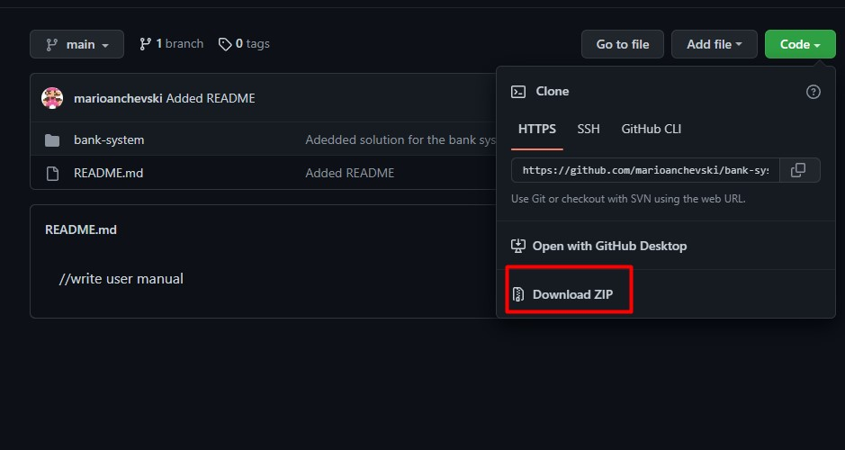
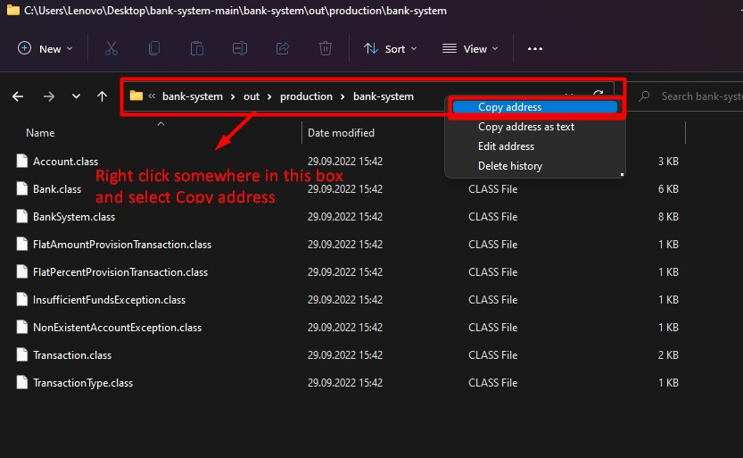

# <div align="center"> **Bank System** </div>

This is an application that simulates the use of a bank. The user can create his own bank, create multiple accounts and make transactions (deposit, withdraw money from an account and send money to other account's).


## **How to run the application**

### ***1.Installing JDK***
Before you can use the application you must first install the JDK (Java Development Kit). You can find a detailed step by step guide on how to do this on the followin [link](https://www.educba.com/install-jdk/).<br>
Once you have JDK installed and set up you can procced to the following step.

### ***2.Downloading the application***
Download the application by choosing "Download ZIP" from the "Code" dropdown menu as shown in the picture below.
 

After downloading the zip file extract it to the location of your choice.

### ***3.Run the application***

Open the extracted zip folder and navigate to 
> <p style="font-size:20px">\bank-system\out\production\bank-system </p>

You then need to copy the apsolute path, to do so right click on the folder address bar and select "Copy address" (see the piture below for more details).

 

 Open up the command line. Write "cd ", paste in the address which you coppied and press enter. (To paste the address use CTRL+V or right click the mouse on the command line).

We are almost done, the last step is to write `java BankSystem` in the command line and press enter. Now the program is up and running.
```
cd C:\Users\Lenovo\Desktop\bank-system-main\bank-system\out\production\bank-system
java BankSystem
```

## **How to use the banking application**


### ***Creating a bank***
When you start the program first you need to create your bank.
First you enter the name, than a flat fee amont, a flat fee percent and lastly a threshold amount.

The flat fee amount and the flat fee percent represent the fee's that you pay when making a transaction. 
The threshold amount is used to determine if the bank charges the user a flat fee or a percent fee. If the amount being transfered is less then the treshold amount you get charged with a flat fee, otherwise a flat percent.


***Example:*** </br>
Let's say that the flat fee is 10.00$, flat percent is 5, threshold amount is 10000.00$.    
If the user wants to withdraw 50.00$ then the bank charges the user 10.00$ for the transaction.<br>
If the user wants to withdraw 12000.00$ the bank charges the user 600.00$ which is 5% of the amount.

NOTE: You always need to enter the amount in the following format `10.00$` ,that is with two decimal places and a dollar sign at the end. (This is true for all the amount's you enter except the flat percent amount which is a number between 0-99)

### ***Main menu***

After creating the bank the main menu will be displayed which is consisted of the following options. To select a option from the menu just enter the number before the option you want to chose.

***Example:*** Enter `5` if you want to check the detail's for the bank that you created. 


***1.Create a new account*** </br>
You can create a new account by selecting this option, you would need to enter a name and a starting balance for the account. (Remember the amount has to be in the following format `10.00$` ,that is with two decimal places and a dollar sign at the end.)

***2.Make a new transaction***</br>
If you select this option you get a new menu which let's you chose the type of transaction you want to make, the three possible options are withdraw, deposit or send money to another account. 

***3.See list of account's***</br>
Display's all the account's that are in the bank.

***4.Check account details***</br>
If you select this option you need to enter the account ID (which consists only of numbers e.g. 10000) of the account you want to check the detail's of.

***5.Check bank details***</br>
The bank detail's will be displayed.

***6.Check total transaction fee amount***</br>
Display's the total amount of money the bank has made trough the transaction fee's.

***7.Check total bank transfer amount***</br>
Display's the total amount of money that has been transfered trough account's.

 ***8.Exit***</br>
 Exit the application
</br>
</br>

---
## **Contact me**
If you find any bug's or have any suggestion's on how to improve the application feel free to contact me. <marioancevski25@gmail.com>

